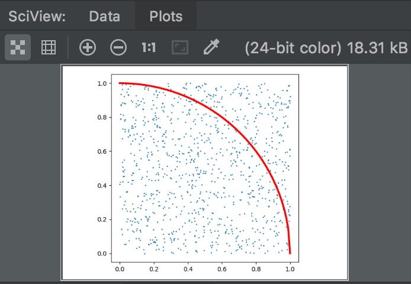
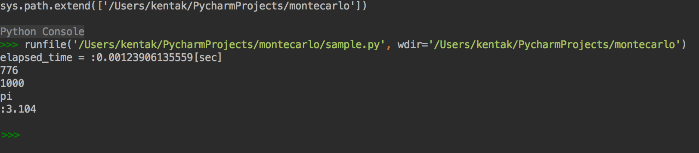

# モンテカルロ法で円周率を求めるPython

# 概要

1. 半径1の正方形を用意する
    * 正方形の面積は1 x 1 = 1
1. 半径1の円(赤線)を引いておく
    * 円の面積はπr^2 / 4 = π / 4
1. 正方形の中にn回点をプロットする。
    * 円の内側m回とする
    * 正方形の面積 : 円の面積 = 1 : πr^2 / 4 = n : m
    * 仮にn = 1000回、m = 820だとすると
        * 1 : π / 4 = 1000 : 820
        * 1000 * π / 4 = 820
        * π = 4 * 820 / 1000
        * π = 3.28
1. nの試行回数を限りなく大きくするとπは限りなくπに近くが、計算時間は膨大になる。

## 実行すると円周率を近似して出力

モンテカルロ法は何回も試行して実際の値に近づけていく方法を言う。

